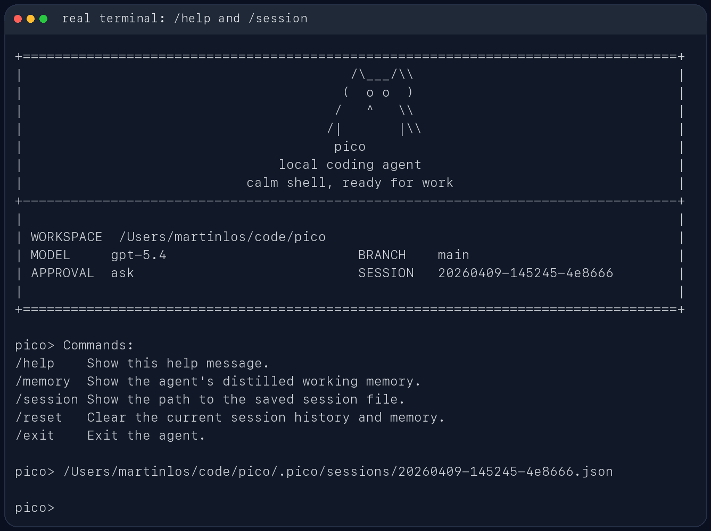

# pico

`pico` 是一个面向代码仓库的轻量本地 coding agent。它直接跑在终端里，先看当前工作区，再用一组受约束的工具去读文件、改文件、跑命令，并把会话状态保存在本地 `.pico/` 目录里。

它更像一个能在仓库里持续工作的命令行助手，不是纯聊天窗口。你可以拿它做代码排查、测试修复、仓库分析，或者让它在当前项目里执行一次性的工程任务。

## 适合做什么

- 在本地仓库里排查测试失败
- 读取当前代码结构并给出修改建议
- 基于现有文件做小步迭代，而不是脱离仓库空想
- 在会话中保留上下文，支持继续上一次工作

## 主要特性

- 包名是 `pico`
- CLI 命令是 `pico`
- 模块入口是 `python -m pico`
- 会话保存在 `.pico/sessions/`
- 每次运行的工件保存在 `.pico/runs/<run_id>/`
- 支持四类模型后端：
  - Ollama
  - OpenAI 兼容 Responses API
  - Anthropic 兼容 Messages API
  - DeepSeek Anthropic 兼容 API
- 使用 TypeSafe Jev 作为快速上下文判断模型，动态选择本轮工具 Schema、History 和 Memory
- 支持 Prompt Cache、结构化 Checkpoint/Resume，以及 `task_state.json`、`trace.jsonl`、`report.json` 运行工件
- 采用工作区路径围栏、Shell 危险命令熔断、审批快照和 macOS Seatbelt 多层安全护栏

## Agent Runtime 架构

Pico 将主模型、Jev 判断模型和 Runtime 职责分开：

```text
用户请求
   ↓
Jev Context Selector
   ├─ 选择本轮工具 Schema
   ├─ 选择相关 History
   └─ 选择相关 Memory
   ↓
Context Manager（预算裁剪 / 压缩 / 当前请求完整保留）
   ↓
主模型 Provider（生成 Tool Call 或最终答案）
   ↓
Sandbox / Approval / Tool Executor
   ↓
Memory / Checkpoint / Trace / Report
```

Jev 是 TypeSafe System One 判断模型，不负责生成代码，也不直接执行工具。它只返回结构化判断和置信度；工具白名单、参数校验、审批、路径边界、Shell 策略和 Seatbelt 仍由 Pico Runtime 强制执行。Jev 服务不可用或置信度不足时，Runtime 自动回退到确定性上下文选择，不会降低安全边界。

## JEV 动态上下文

Jev 在每一轮主模型调用前判断：

- `tool_scope`：只加载 inspect、modify、execute、delegate 或 none 对应的工具 Schema；
- `history_scope`：保留最近、相关或最小历史窗口；
- `memory_scope`：决定是否带入相关工作记忆和过程笔记。

这样可以避免每轮把全部工具、完整历史和无关记忆塞进 Prompt。完整工具结果仍保存在本地运行工件中，动态裁剪只影响发给模型的上下文。

### 配置 JEV

安装依赖：

```bash
uv sync
```

复制环境模板并填写 TypeSafe key：

```bash
cp .env.example .env
```

在 `.env` 中配置：

```bash
TYPESAFE_API_KEY="your-typesafe-api-key"
TYPESAFE_MODEL="jev-1.12"
PICO_JEV_ENABLED=1
```

真实 API key 只放在本地 `.env`，不要提交到 Git。关闭 JEV 时设置 `PICO_JEV_ENABLED=0`，Pico 会使用确定性回退策略继续运行。

相关实现和设计说明：

- [`pico/jev_selector.py`](pico/jev_selector.py)
- [`docs/architecture/jev-context-selection.md`](docs/architecture/jev-context-selection.md)
- [`docs/architecture/prompt-cache-context-engineering-design.md`](docs/architecture/prompt-cache-context-engineering-design.md)

## 使用截图

CLI 帮助信息：


启动界面：


REPL 内置命令与会话路径：



## 安装

需要 Python 3.10+。

如果你用 `uv`，直接安装依赖：

```bash
uv sync
```

如果你已经在自己的 Python 环境里工作，也可以直接装成可编辑模式：

```bash
pip install -e .
```

## 快速开始

在当前仓库里启动交互模式。默认 provider 是 DeepSeek：

```bash
uv run pico
```

指定另一个工作目录：

```bash
uv run pico --cwd /path/to/repo
```

直接跑一次性任务：

```bash
uv run pico "inspect the test failures and propose a fix"
```

启动本地 Web 工作台：

```bash
uv run pico --web
```

默认地址是 `http://127.0.0.1:8765`。Web 模式支持多轮对话、会话切换、运行状态查看，以及在 `--approval ask` 下通过浏览器确认高风险工具。工作台右上角的设置按钮可以切换工作区、Provider 和模型；切换会重新装配一个 Agent，并使用目标项目独立的 Git 状态、`.env`、Session 和运行工件。会话名称会在第一条用户问题提交后自动使用该问题生成。可以覆盖监听地址和端口：

```bash
uv run pico --web --web-host 127.0.0.1 --web-port 9000
```

Web 服务没有登录层，默认只监听本机。除非外部网络已经有可靠的访问控制，否则不要把 `--web-host` 设置为 `0.0.0.0`。

如果当前环境已经安装过包，也可以直接这样启动：

```bash
python -m pico
```

## 模型后端

Pico 启动时会读取项目根目录的 `.env`。本地真实 key 放在 `.env`，仓库只保留 `.env.example`。配置优先级是：

```text
显式 CLI 参数 > .env 里的 PICO_* 变量 > 旧环境变量 > 代码默认值
```

Provider 选择的具体顺序是：

```text
--provider > PICO_PROVIDER > 代码默认 deepseek
```

不传 `--provider` 且没有 `PICO_PROVIDER` 时默认使用 `deepseek`。这是推荐配置路径：DeepSeek 的 Anthropic-compatible endpoint 比本地 Ollama 更少依赖本机模型环境，也比 OpenAI-compatible/Anthropic-compatible 代理少一层默认 gateway 假设。其他 provider 仍然保留，可以在 `.env` 里写 `PICO_PROVIDER=openai`、`PICO_PROVIDER=anthropic`、`PICO_PROVIDER=ollama`，也可以显式传 `--provider openai`、`--provider anthropic` 或 `--provider ollama`。

`.env` 会在构建 provider client 前加载，并覆盖当前进程里的同名环境变量。模型名和 base URL 可以通过 `--model`、`--base-url` 临时覆盖；API key 只从环境变量读取。

本地第一次配置：

```bash
cp .env.example .env
```

然后把要使用的 provider key 填进去。`.env` 已经被 `.gitignore` 忽略，不要提交真实 key。

### 推荐配置：DeepSeek

最小配置只需要 key：

```bash
PICO_DEEPSEEK_API_KEY="your-api-key"
```

默认模型和接口是：

```bash
PICO_DEEPSEEK_API_BASE="https://api.deepseek.com/anthropic"
PICO_DEEPSEEK_MODEL="deepseek-v4-pro"
```

所以常规情况下 `.env` 里只填 `PICO_DEEPSEEK_API_KEY` 就能直接启动：

```bash
uv run pico
```

如果你需要临时切模型或代理地址，不必改 `.env`，可以直接覆盖：

```bash
uv run pico --model deepseek-v4-pro --base-url https://api.deepseek.com/anthropic
```

DeepSeek 当前走 Anthropic-compatible Messages API，所以 runtime 里复用的是 Anthropic-compatible client；这只影响 HTTP 协议，不影响 CLI 用法。

### 可选配置：right.codes

right.codes 在 Pico 里有两条可选 provider 路径：

- `--provider openai`：走 OpenAI-compatible `/responses`，默认 base URL 是 `https://www.right.codes/codex/v1`，默认模型是 `gpt-5.4`
- `--provider anthropic`：走 Anthropic-compatible `/messages`，默认 base URL 是 `https://www.right.codes/claude/v1`，默认模型是 `claude-sonnet-4-6`

如果 right.codes 给你的是一把共享 key，推荐只填这一项：

```bash
PICO_RIGHT_CODES_API_KEY="your-right-codes-key"
```

然后按需要选择 provider：

```bash
uv run pico --provider openai
uv run pico --provider anthropic
```

如果你想显式区分两条 provider 的 key，也可以分别配置：

```bash
PICO_OPENAI_API_KEY="your-right-codes-key-for-codex"
PICO_ANTHROPIC_API_KEY="your-right-codes-key-for-claude"
```

不要在 `.env` 里写 `PICO_OPENAI_API_KEY=$PICO_RIGHT_CODES_API_KEY` 这种 shell 展开形式；Pico 的 `.env` 解析器只读取字面量，不展开变量引用。要么只写 `PICO_RIGHT_CODES_API_KEY`，要么把 key 字符串分别填到 provider-specific 变量里。

如果请求 right.codes 返回 `API Key额度不足`，说明协议和 endpoint 已经打通，但当前 key 没有可用额度；换一把有额度的 key，或到 right.codes 后台处理额度。

当前 provider 环境变量：

| provider | base URL | API key | model |
| --- | --- | --- | --- |
| `deepseek` | `PICO_DEEPSEEK_API_BASE`，回退 `DEEPSEEK_API_BASE`，默认 `https://api.deepseek.com/anthropic` | `PICO_DEEPSEEK_API_KEY`，回退 `DEEPSEEK_API_KEY` | `PICO_DEEPSEEK_MODEL`，回退 `DEEPSEEK_MODEL`，默认 `deepseek-v4-pro` |
| `openai` | `PICO_OPENAI_API_BASE`，回退 `OPENAI_API_BASE`，默认 `https://www.right.codes/codex/v1` | `PICO_OPENAI_API_KEY`，回退 `OPENAI_API_KEY`、`PICO_RIGHT_CODES_API_KEY`、`RIGHT_CODES_API_KEY`、`PICO_ANTHROPIC_API_KEY`、`ANTHROPIC_API_KEY` | `PICO_OPENAI_MODEL`，回退 `OPENAI_MODEL`，默认 `gpt-5.4` |
| `anthropic` | `PICO_ANTHROPIC_API_BASE`，回退 `ANTHROPIC_API_BASE`，默认 `https://www.right.codes/claude/v1` | `PICO_ANTHROPIC_API_KEY`，回退 `ANTHROPIC_API_KEY`、`PICO_RIGHT_CODES_API_KEY`、`RIGHT_CODES_API_KEY`、`PICO_OPENAI_API_KEY`、`OPENAI_API_KEY` | `PICO_ANTHROPIC_MODEL`，回退 `ANTHROPIC_MODEL`，默认 `claude-sonnet-4-6` |
| `ollama` | `--host`，默认 `http://127.0.0.1:11434` | 不需要 | `--model`，默认 `qwen3.5:4b` |

如果有额外的敏感环境变量需要从 trace/report 里脱敏，可以用 `PICO_SECRET_ENV_NAMES` 配置逗号分隔的变量名，或启动时重复传 `--secret-env-name NAME`。

### OpenAI 兼容接口

如果要改用 OpenAI-compatible `/responses` 服务，显式传 `--provider openai`：

```bash
uv run pico --provider openai
```

默认 OpenAI 兼容接口使用 right.codes 的 Codex endpoint：

```bash
PICO_OPENAI_API_BASE="https://www.right.codes/codex/v1"
PICO_RIGHT_CODES_API_KEY="your-right-codes-key"
PICO_OPENAI_MODEL="gpt-5.4"
```

也可以改成其他 OpenAI-compatible 服务：

```bash
PICO_OPENAI_API_BASE="https://your-api.example/v1"
PICO_OPENAI_API_KEY="your-api-key"
PICO_OPENAI_MODEL="gpt-5.4"
```

### Anthropic 兼容接口

如果要改用 Anthropic-compatible 服务，显式传 `--provider anthropic`：

```bash
uv run pico --provider anthropic
```

默认 Anthropic 兼容接口使用 right.codes 的 Claude endpoint：

```bash
PICO_ANTHROPIC_API_BASE="https://www.right.codes/claude/v1"
PICO_RIGHT_CODES_API_KEY="your-right-codes-key"
PICO_ANTHROPIC_MODEL="claude-sonnet-4-6"
```

如果你的服务端对多个兼容接口复用了同一套密钥，`pico` 也支持从 `PICO_ANTHROPIC_API_KEY` 回退到 `ANTHROPIC_API_KEY`、`PICO_RIGHT_CODES_API_KEY`、`RIGHT_CODES_API_KEY`、`PICO_OPENAI_API_KEY` 或 `OPENAI_API_KEY`。

### Ollama

如果要改用本地 Ollama，显式传 `--provider ollama`：

```bash
ollama serve
ollama pull qwen3.5:4b
uv run pico --provider ollama --model qwen3.5:4b
```

## 近期运行时升级

当前 GitHub `main` 已包含三个独立阶段的实现：

1. **上下文压缩与预算裁剪**：按需装配工具、History 和 Memory，减少无关上下文。
2. **Prompt Cache**：稳定 Prefix、模型级 cache epoch，以及 Provider 命中率 telemetry。
3. **Checkpoint / Prompt Resume**：保存结构化任务状态，并检测 Workspace、History 和运行配置漂移。

完整更新说明见 [`docs/architecture/runtime-upgrades-2026-10.md`](docs/architecture/runtime-upgrades-2026-10.md)。

## 常用交互命令

- `/help`：查看内置命令
- `/memory`：查看提炼后的工作记忆
- `/session`：查看当前会话文件路径
- `/reset`：清空当前会话状态
- `/exit` 或 `/quit`：退出 REPL

## 安全与持久化

`pico` 不会默认把所有动作都放开。像 shell 执行、文件写入这类高风险操作，会受审批模式控制：

- `--approval ask`
- `--approval auto`
- `--approval never`

每次运行结束后，都会在 `.pico/runs/<run_id>/` 下写出这些文件：

- `task_state.json`
- `trace.jsonl`
- `report.json`

这些内容默认只保存在本地，不需要跟仓库一起提交。

### 第一阶段可靠性能力

支持原生 Tool Calling 的 provider 会接收严格 JSON Schema 工具定义，runtime 将 provider 返回的结构化调用统一转换为 Pico 工具请求。Ollama 和不支持该能力的 OpenAI-compatible endpoint 继续使用原有 `<tool>/<final>` 文本协议，因此旧 provider 与 FakeModelClient 不受影响。

`patch_file_v2` 接收 workspace-bounded unified diff，可选用 SHA-256 前置条件防止覆盖已变化的文件。修改前会执行 `git apply --check`；修改后会返回实际 workspace diff，并按文件类型运行轻量 targeted verification：Python 优先运行对应 pytest、否则 compileall，JavaScript 使用 `node --check`，JSON 使用解析校验。验证失败会记录为 `partial_success`，保留现场供下一轮模型修复。旧 `write_file` 和 `patch_file` 的直接返回文本保持不变，但 Agent history、trace 和工具 metadata 会记录自动 diff。

真实模型对照评测会用同一任务集、相同重复次数分别运行原生 Tool Calling 与文本协议：

```bash
.venv/bin/python scripts/run_phase1_benchmark.py \
  --provider gpt \
  --repetitions 3
```

结果默认写入 `artifacts/phase1-reliability-ablation.json`，包含任务通过率、verifier 通过率、平均工具步数、平均尝试次数、malformed tool rate、patch 失败数和验证失败数。该命令会调用真实 provider 并消耗 API 额度，不属于普通单元测试或 CI 默认步骤；结论应基于多次重复结果，而不是单次样本。

## 开发

常用本地检查：

```bash
uv run pytest tests -q
uv run ruff check pico tests scripts
```

内部代码现在按较轻的边界拆分：`pico/evaluation/` 放 benchmark 和 metrics，`pico/providers/` 放模型 provider client，`pico/features/` 放可选运行时能力。新代码应直接使用这些包路径；旧的 `pico.evaluator`、`pico.metrics`、`pico.models` 和 `pico.memory` import 不再作为公共入口保留。
