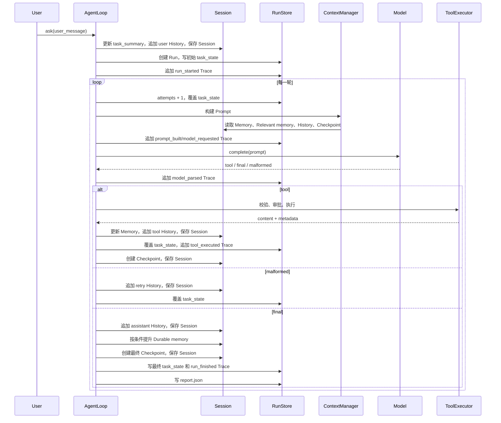

# Pico 的状态、记忆与运行工件

本文梳理 Pico 中容易混淆的几个概念：`Session`、`History`、`Memory`、`Relevant memory`、长期记忆、`Checkpoint`、`task_state.json`、`trace.jsonl` 和 `report.json`。

最重要的结论是：**它们不全是“给模型看的记忆”**。

- `History`、工作记忆、相关记忆和 `Checkpoint` 会参与后续 Prompt 构建。
- `Session` 是保存这些可恢复状态的容器，不是与它们并列的另一份记忆。
- `task_state.json`、`trace.jsonl` 和 `report.json` 是一次 `ask()` 的运行证据，主要供调试、评测和 UI 使用，默认不会重新喂给模型。

## 1. 先看整体关系

一次 Session 可以包含多次 `ask()`；每次 `ask()` 都会产生一个独立 Run。

```text
Session（一个可继续对话的会话）
├── History（用户、工具、助手的时间顺序记录）
├── Memory（会话内的紧凑工作集）
│   ├── working.task_summary
│   ├── working.recent_files
│   ├── file_summaries
│   └── episodic_notes
├── Checkpoints（恢复锚点）
├── runtime_identity
└── resume_state

Workspace 长期记忆（独立于某个 Session）
└── .pico/memory/
    ├── MEMORY.md
    └── topics/*.md

Run（一次 ask()）
└── .pico/runs/<run_id>/
    ├── task_state.json
    ├── trace.jsonl
    └── report.json

Relevant memory
└── 不单独落盘；每次构建 Prompt 时，从 episodic_notes 和长期记忆临时召回
```

落盘目录大致如下：

```text
<workspace>/.pico/
├── sessions/
│   └── <session_id>.json
├── memory/
│   ├── MEMORY.md
│   └── topics/
│       ├── project-conventions.md
│       ├── key-decisions.md
│       ├── dependency-facts.md
│       └── user-preferences.md
└── runs/
    └── <run_id>/
        ├── task_state.json
        ├── trace.jsonl
        └── report.json
```

## 2. 一张表看清区别

| 名称 | 本质 | 保存范围 | 是否落盘 | 是否进入后续 Prompt | 主要用途 |
|---|---|---|---|---|---|
| Session | 可恢复会话的总容器 | 多次 `ask()` | 是，`sessions/<id>.json` | 容器本身不直接进入；内部字段会进入 | 恢复同一对话现场 |
| History | Session 内的事件流水 | 多次 `ask()` | 跟随 Session 落盘 | 是，但会压缩和裁剪 | 让模型看到真实对话与工具结果 |
| Working memory | 当前任务的紧凑工作集 | 当前 Session | 跟随 Session 落盘 | 是，作为 `Memory:` | 快速提醒当前任务和最近文件 |
| Episodic notes | 会话内短笔记 | 当前 Session | 跟随 Session 落盘 | 相关时才进入 | 保存读文件摘要、失败提示等短结论 |
| Relevant memory | 一次 Prompt 的召回视图 | 当前模型调用 | 否 | 是 | 从候选笔记中只选当前问题相关内容 |
| Durable memory | 工作区级长期事实 | 跨 Session | 是，`.pico/memory/` | 相关时才进入 | 保存稳定约定、决策、依赖事实和偏好 |
| Checkpoint | 任务恢复锚点 | 当前 Session | 跟随 Session 落盘 | 是，追加到 Prompt 前部 | 中断后判断从哪里继续、旧状态是否过期 |
| TaskState | 一次 Run 的状态机快照 | 单次 `ask()` | 是，覆盖写 | 否 | 表示当前状态、次数、停止/失败原因 |
| Trace | 一次 Run 的事件时间线 | 单次 `ask()` | 是，逐行追加 | 否 | 回答“具体按什么顺序发生了什么” |
| Report | 一次 Run 的最终摘要 | 单次 `ask()` | 是，终止时写 | 否 | 快速查看结果、关键指标和失败信息 |

## 3. Session：可恢复状态的容器

Session 由 [`SessionStore`](../../pico/session_store.py) 保存为一个 JSON 文件。一个 Session 对应一个可继续使用的对话，而不是一次模型调用或一次工具调用。

典型结构：

```json
{
  "id": "20260725-154342-56f15c",
  "title": "解释 Pico 的状态系统",
  "created_at": "...",
  "workspace_root": "/path/to/repo",
  "history": [],
  "memory": {},
  "checkpoints": {
    "current_id": "...",
    "items": {}
  },
  "runtime_identity": {},
  "resume_state": {}
}
```

### Session 什么时候写入

- 创建 `Pico` 实例时会保存一次，确保新 Session 存在。
- `record()` 每追加一条 History，就立即保存整个 Session。
- 创建 Checkpoint 后立即保存 Session。
- 长期记忆提升完成后，会同步 Session 中的 memory 状态。
- `/clear` 或 `reset()` 清空 History 和会话内 Memory 后保存。

### Session 什么时候读取

- 新会话直接构造默认结构。
- 使用 `--resume <session_id>` 或恢复 UI 会话时，`SessionStore.load()` 读取整个 JSON。
- `Pico` 从 `session["memory"]` 重建 `LayeredMemory`，并从 Session 中恢复 History、Checkpoint 和 runtime identity。

所以，**History、会话内 Memory 和 Checkpoint 都是 Session 的字段**。说“Session 和 History 分别保存了两份对话”是不准确的；应该说“Session 文件里包含 History”。

## 4. History：相对完整的事件流会话记录

History 是 `session["history"]` 列表。它完整保留事件类型、顺序、工具参数和 Runtime 可见的工具结果；但工具结果在进入 History 前已经经过执行层长度裁剪，并不等于子进程的无限原始输出。当前实现记录三类条目：

```json
{"role": "user", "content": "修复测试", "created_at": "..."}
```

```json
{
  "role": "tool",
  "name": "read_file",
  "args": {"path": "runtime.py", "start": 1, "end": 100},
  "content": "# runtime.py\n...",
  "created_at": "..."
}
```

```json
{"role": "assistant", "content": "修复完成", "created_at": "..."}
```

### History 什么时候写入

- `ask()` 开始：写入当前用户请求。
- 工具执行结束：写入工具名、参数和结果，包括成功或失败结果。
- 模型输出格式错误：写入 Runtime 生成的 retry 提示。
- 模型正常返回 final：写入最终回答。
- 达到步数/重试上限：写入停止说明。
- 模型接口异常：写入脱敏后的失败说明。

每次写 History 都通过 `record()` 立即保存 Session。因此不是“最后返回后才保存 History”。

### History 什么时候读取

每一轮模型调用前，[`ContextManager`](../../pico/context_manager.py) 都读取 Session History，渲染成 `Transcript:` 段落：

- 最近 6 条尽量详细保留。
- 较老内容按预算裁剪。
- 较老的重复 `read_file` 会折叠。
- 较老工具结果会变成短摘要。
- 如果存在有效 `file_summary`，旧文件读取可以用摘要代替。

因此，磁盘里的 History 较完整；真正进入 Prompt 的是**预算受限的 History 视图**。

当前请求在 `ask()` 开头已经进入 History，同时还会作为 `Current user request:` 放到 Prompt 最后。这个显式重复保证最新要求不会因 History 压缩而丢失。

## 5. Memory：会话内的紧凑工作集

Memory 保存在 `session["memory"]`，由 [`LayeredMemory`](../../pico/features/memory.py) 管理。它不是完整回放，而是从工具结果中提炼出的少量高价值状态。

### 5.1 Working memory

Working memory 包含：

```json
{
  "task_summary": "当前用户请求的短摘要",
  "recent_files": ["runtime.py", "tests/test_runtime.py"]
}
```

- `task_summary`：每次 `ask()` 开始时，用当前用户请求更新，最多约 300 字。
- `recent_files`：最近读写过的文件，最多 8 个。

它在每轮 Prompt 中渲染为：

```text
Memory:
- task: 修复 runtime 的测试
- recent_files: runtime.py, tests/test_runtime.py
```

### 5.2 File summaries

读取文件成功后，Pico 会把读取结果的前几条有效内容压缩成短摘要，并记录文件内容哈希：

```json
{
  "runtime.py": {
    "summary": "...",
    "created_at": "...",
    "freshness": "sha256..."
  }
}
```

用途：

- 下一轮快速提醒模型刚读过什么。
- 压缩旧 History 中的文件读取结果。
- 避免为了一个已知短事实重复读取文件。

写入或 patch 某个文件后，旧摘要会立即失效。每次构建 Prompt/检查恢复状态时还会重新比较文件哈希，变化的摘要会被删除。

### 5.3 Episodic notes

`episodic_notes` 是当前 Session 内最多 12 条短笔记，每条包含：

```json
{
  "text": "run_shell error on workspace; check the failure before retry",
  "tags": ["process", "error"],
  "source": "run_shell",
  "created_at": "...",
  "note_index": 3,
  "kind": "process"
}
```

当前自动写入的典型内容：

- `read_file` 的短摘要。
- 工具 `rejected`、`error` 或 `partial_success` 后的过程提示。

Episodic notes 不会全部塞进每轮 Prompt。`Memory:` 只显示它们的数量，正文由 Relevant memory 按需召回。

与 `file_summaries` 不同，Episodic notes 表示“当时观察到了什么”，不附带文件 freshness 校验。文件后来被修改时，旧 file summary 会失效，但相应 episodic note 仍可能作为历史观察保留；需要精确当前内容时仍应重新读取文件。

## 6. Relevant memory：每轮临时生成的召回结果

Relevant memory **不是独立存储文件，也不是另一套长期记忆**。它是每次构建 Prompt 时产生的临时视图。

来源有两类：

1. 当前 Session 的 `episodic_notes`。
2. 当前 Workspace 的 Durable memory。

Pico 使用当前用户请求作为 query，根据 tag 命中、关键词重叠、时间和插入顺序排序，默认最多取 3 条：

```text
Relevant memory:
- runtime.py 中 ask() 会进入 AgentLoop
- run_shell error on workspace; check the failure before retry
```

生成时机：每一轮 `_build_prompt_and_metadata()` 调用中。

使用时机：紧接 `Memory:` 之后放进本轮 Prompt。

保存时机：不保存正文副本；只会把本轮选中了哪些 notes 记录进 Prompt metadata，随后出现在 Trace 和最终 Report 中。

这层的意义是：Memory 可以保存多条笔记，但每轮只为当前问题带入最相关的少量内容。

## 7. Durable memory：跨 Session 的工作区长期记忆

长期记忆不放在某个 Session JSON 里，而是保存在：

```text
.pico/memory/MEMORY.md
.pico/memory/topics/*.md
```

当前主题包括：

- `project-conventions`：项目稳定约定。
- `key-decisions`：长期设计决策及理由。
- `dependency-facts`：稳定依赖和环境事实。
- `user-preferences`：稳定用户偏好。

### 长期记忆什么时候写入

它不是每次工具执行都写，也不是每次 final 都自动写。

只有当用户请求明确表达“记住/长期保存”意图，并且 final 中出现可识别的稳定事实格式时，Pico 才尝试 promotion。临时任务状态、疑似密钥、stdout/stderr 和过长噪声会被拒绝。

Promotion 发生在 final 产生后、最终 Checkpoint 和 Report 写入前。写入、拒绝和替换情况会进入最终 Report。

### 长期记忆什么时候读取

每次构建 Relevant memory 时，Pico 都会加载长期主题和 notes，并与当前 Session 的 episodic notes 一起排序。只有相关条目才进入 Prompt。

因此：

- Working/Episodic memory 服务当前 Session。
- Durable memory 服务整个 Workspace，可跨 Session 复用。

## 8. Checkpoint：可恢复任务的锚点

Checkpoint 保存在 Session 的 `checkpoints.items` 中，`current_id` 指向最新一项。它不是完整 History 的副本，而是恢复任务需要的最小锚点：

```json
{
  "checkpoint_id": "ckpt_1234abcd",
  "parent_checkpoint_id": "ckpt_previous",
  "schema_version": "phase1-v1",
  "current_goal": "修复测试",
  "completed": [],
  "current_blocker": "step_limit_reached",
  "next_step": "Resume from the latest checkpoint and continue the task.",
  "key_files": [{"path": "runtime.py", "freshness": "sha256..."}],
  "runtime_identity": {
    "cwd": "...",
    "model": "...",
    "approval_policy": "...",
    "workspace_fingerprint": "...",
    "tool_signature": "..."
  }
}
```

### Checkpoint 什么时候写入

- 每次工具执行后。
- Context 被压缩时。
- 检测到文件 freshness 不一致时。
- 检测到 Workspace/runtime identity 不一致时。
- 模型请求异常时。
- 正常 final 时。
- 达到 step/retry limit 停止时。

创建后立即保存 Session，并把 `checkpoint_id` 写回 TaskState。

### Checkpoint 什么时候读取

- `Pico` 创建或恢复 Session 时计算 `resume_state`。
- 每轮构建 Prompt 前再次比较：Checkpoint schema、关键文件哈希、Workspace fingerprint、模型、工具签名、审批策略等。
- 当前 Checkpoint 会渲染成 `Task checkpoint:` 文本，追加到 Prompt 前部。

恢复状态可能是：

```text
no-checkpoint
full-valid
partial-stale
workspace-mismatch
schema-mismatch
```

所以 Checkpoint 的作用不是“记住所有对话”，而是回答：**任务上次停在哪里、哪些状态还能信、下一步应该做什么。**

## 9. task_state.json：单次 Run 的状态机快照

每次 `ask()` 都创建一个新的 `TaskState`，保存到：

```text
.pico/runs/<run_id>/task_state.json
```

主要字段：

```json
{
  "status": "running",
  "attempts": 2,
  "tool_steps": 1,
  "last_tool": "read_file",
  "stop_reason": "",
  "failure_code": "",
  "failure_message": "",
  "checkpoint_id": "ckpt_...",
  "resume_status": "full-valid"
}
```

### 什么时候写入

- Run 创建时立即写入。
- 每轮调用模型前，`attempts += 1` 后覆盖写。
- 工具调用计数更新后覆盖写。
- Retry 后覆盖写。
- 创建关键 Checkpoint 后覆盖写。
- final、模型异常、step limit 或 retry limit 确定后写最终状态。

它采用原子覆盖写，因此文件表示“当前最新状态”，不是事件列表。

### 什么时候读取

正常 Agent Prompt 构建不会读取 `task_state.json`。运行时直接使用内存中的 `TaskState` 对象。该文件主要由 Web UI、调试工具、评测器和人工复盘读取。

## 10. trace.jsonl：单次 Run 的追加式事件时间线

Trace 保存在：

```text
.pico/runs/<run_id>/trace.jsonl
```

JSONL 表示“一行一个 JSON 事件”。典型事件：

```text
run_started
prompt_built
model_requested
model_parsed
tool_executed
checkpoint_created
runtime_identity_mismatch
run_failed
run_finished
```

工具事件还会记录：

- 工具名、参数和裁剪后的结果。
- 执行耗时。
- `tool_status`、`tool_error_code`、`security_event_type`。
- 影响的路径、Workspace 是否变化、diff summary。

### 什么时候写入

Trace 从 Run 开始就逐事件追加。每次 Prompt 构建、模型请求、模型解析、工具执行、Checkpoint 创建和 Run 结束都会立即追加一行。

所以 `trace.jsonl` **不是 final 后才生成**。即使程序中途失败，前面已经落盘的事件通常仍然存在，这正是使用 JSONL 追加写的原因。

### 什么时候读取

默认 Agent 循环不会把 Trace 重新放进 Prompt。它主要供：

- Web 运行检查器展示。
- 调试“第几步出了什么问题”。
- Benchmark 和 metrics 汇总耗时、安全事件、工具状态。
- 人工审计。

## 11. report.json：单次 Run 的终态摘要

Report 保存在：

```text
.pico/runs/<run_id>/report.json
```

它汇总：

- `status`、`stop_reason`、`failure_code`、`failure_message`。
- 最终回答。
- 工具步数和模型调用次数。
- 最新 Checkpoint ID 和 resume status。
- TaskState 的最终副本。
- 最后一轮 Prompt metadata。
- Prompt Cache/Token 信息（Provider 返回时）。
- Durable memory 的 promotion、rejection 和 superseded 结果。
- 脱敏后的环境变量摘要。

### 什么时候写入

Report 在一次 `ask()` 到达终态时写入：

- 模型返回正常 final。
- 达到 step limit。
- 达到 retry limit。
- 模型接口异常。在抛出 `RuntimeError` 前也会先写 Report。

因此，准确说法不是“只有返回 final 才写 Report”，而是“**本次 Run 结束或失败时写最终 Report**”。

### 什么时候读取

默认 Agent 循环不会读取 Report 作为记忆。Report 主要供 UI、评测器、统计程序和人工复盘读取。

## 12. 它们和 Agent 循环的完整时序



每一轮真正发给模型的内容顺序是：

```text
Prefix（附当前 Checkpoint）
+ Memory（task、recent files、有效 file summaries）
+ Relevant memory（本轮临时召回）
+ History（压缩后的 Transcript）
+ Current request（最新请求，放在最后）
```

`task_state.json`、`trace.jsonl` 和 `report.json` 不在这个 Prompt 链条中。

## 13. 为什么看起来有冗余

确实有字段重复，但大部分是不同视角的有意重复：

```text
History：完整事实流水
Memory：从流水中提炼的紧凑工作集
Checkpoint：恢复任务需要的最小锚点
TaskState：当前状态机快照
Trace：事件发生顺序
Report：最终结果摘要
```

例如一次 `read_file` 可能同时出现在：

- History：完整参数和经过工具执行层裁剪的结果。
- Memory：文件名和短摘要。
- Checkpoint：关键文件路径和 freshness hash。
- TaskState：只记录 `last_tool=read_file` 和计数。
- Trace：记录执行耗时、状态和影响路径。
- Report：只保留最终计数和最后一轮 Prompt 元数据，不复制完整 Trace。

这些不是六份相同数据，而是“原始记录、压缩索引、恢复锚点、实时状态、审计时间线、最终摘要”六种用途。

当前 Memory 中还保留 `task/files/notes`，同时又有 `working.task_summary/recent_files/episodic_notes`。这部分属于兼容旧结构的别名，确实存在数据重复，由 normalization 保持同步。生产化时可以通过 schema migration 移除旧别名。

长期运行还需要考虑：

- Session History 和 Checkpoint items 的保留上限。
- 旧 Run 工件的清理策略。
- 是否让 Report 引用 Trace，而不是重复少量字段。
- Schema 版本迁移。

但不能为了“去重”把所有内容塞进一个文件，否则恢复、实时 UI、崩溃保护和审计都会变困难。

## 14. 最简记忆法

```text
Session = 一个可以恢复的会话文件
History = Session 里的完整对话/工具流水
Memory = Session 里的短期提炼结果
Relevant memory = 每轮从短期和长期笔记中临时选出的内容
Durable memory = 跨 Session 保存的稳定项目事实
Checkpoint = 中断续跑时使用的任务锚点

TaskState = 这次 ask 当前进行到哪
Trace = 这次 ask 每一步发生了什么
Report = 这次 ask 最后结果怎么样
```

相关实现入口：

- [`pico/agent_loop.py`](../../pico/agent_loop.py)：写入时序和主循环。
- [`pico/runtime.py`](../../pico/runtime.py)：Session/History、Memory 更新、Trace 和 Report 组装。
- [`pico/context_manager.py`](../../pico/context_manager.py)：读取并组装 Prompt。
- [`pico/features/memory.py`](../../pico/features/memory.py)：Working、Episodic、Relevant 和 Durable memory。
- [`pico/checkpoint.py`](../../pico/checkpoint.py)：Checkpoint 和恢复状态。
- [`pico/run_store.py`](../../pico/run_store.py)：TaskState、Trace、Report 落盘。
- [`pico/task_state.py`](../../pico/task_state.py)：单次 Run 状态机。
- [`pico/session_store.py`](../../pico/session_store.py)：Session JSON 持久化。
